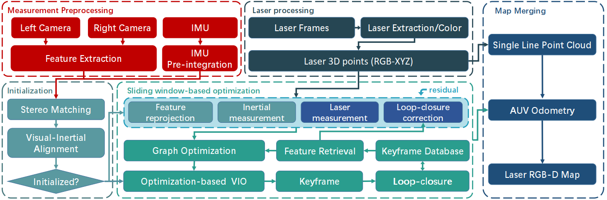

<h1 align="center">UVLI-SLAM: Precise Underwater RGB-D Mapping via Visual-Laser-Inertial SLAM</h1>

<p align="center"><strong>
    Yajun Gao</a><sup>1</sup>,
    <a href = "https://scholar.google.com/citations?user=iUUu8PkAAAAJ&hl=zh-CN">Yang Cong</a><sup>2</sup>,
    Mingxue Li</a><sup>1</sup>,
    Xu Tang</a><sup>1</sup>,
</strong></p>

<p align="center"><strong>
    1: State Key Laboratory of Robotics, Shenyang Institute of Automation, Chinese Academy of Sciences</a><br>
    2: College of Automation Science and Engineering, South China University of Technology</a><br>
</strong></p>


<p align="middle">
  
</p>

## :eyes: Updates
* [2024.11] We created the project and subsequently released the code and dataset.


## :checkered_flag: Test Environment
### Dependencies
* OpenCV 4.2
* Eigen 3
* Ceres 2.0.0
* G2O 
* CUDA 12.1
* python
* ROS
* Boost


## :book: Data
The deep-sea 3D dataset contains more than 20,000 seafloor images.

```
dataroot
├── cam0
│       ├── t0.jpg
│       ├── t1.jpg
│       ├── t2.jpg
│       └── ......
├── cam1
│       ├── t0.jpg
│       ├── t1.jpg
│       ├── t2.jpg
│       └── ......
├── laser
│       ├── t0.jpg
│       ├── t1.jpg
│       ├── t2.jpg
│       └── ......
└── imu0
    └── data.csv
