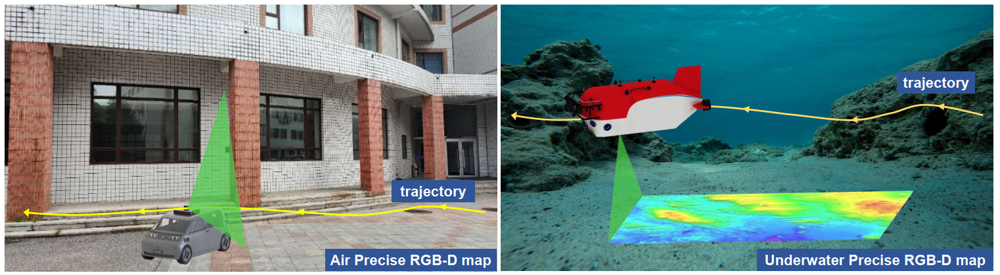
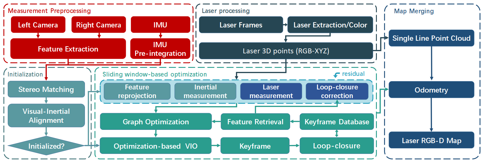

<h1 align="center">PVLI-SLAM: Precise RGB-D Mapping via Visual-Laser-Inertial SLAM</h1>


<p align="middle">
  
</p>
Precise RGB-D mapping. Air: a car carrying the device orbits around the building; Underwater: a remotely operated vehicle (ROV) sails along a predefined trajectory near the seabed, about 2-3 meters away from the target, and the device projects a laser line and captures stereo images, ultimately generating an precise RGB-D map using our algorithm.

<p align="middle">
  
</p>
The framework of our proposed PVLI-SLAM. The algorithm starts with a measurement preprocessing and initialization module; the laser processing module generates an precise single-line point cloud; the sliding window-based back-end optimization module tightly integrates visual point-line features, IMU measurements, and laser line to perform global optimization. Finally, the map merging module combines the running trajectory and the single-line point cloud to generate a real-time, precise, and dense RGB-D map.

## :eyes: Updates
* [2026.01] We created the project and subsequently released the code and dataset.


## :checkered_flag: Test Environment
### Dependencies
* OpenCV 4.2
* Eigen 3
* Ceres 2.0.0
* G2O 
* CUDA 12.1
* python
* ROS
* Boost


## :book: Data
The deep-sea 3D dataset contains more than 20,000 seafloor images.

```
dataroot
├── cam0
│       ├── t0.jpg
│       ├── t1.jpg
│       ├── t2.jpg
│       └── ......
├── cam1
│       ├── t0.jpg
│       ├── t1.jpg
│       ├── t2.jpg
│       └── ......
├── laser
│       ├── t0.jpg
│       ├── t1.jpg
│       ├── t2.jpg
│       └── ......
└── imu0
    └── data.csv
